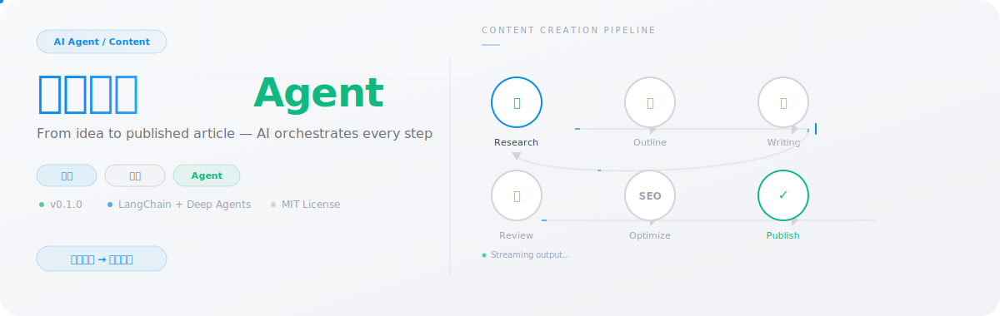

<p align="center">
  
</p>

# 内容创作Agent

AI 驱动的内容创作工具，支持主题研究、结构化大纲生成、流式文章写作、SEO 分析与关键词建议，具备版本管理、持久记忆和 GitHub 登录用户隔离。基于 LangChain 和 Deep Agents 构建，部署在 EdgeOne Makers。

**Framework:** Deep Agents · **Category:** Content · **Language:** TypeScript

## 概述

本模板通过多阶段 Agent 工作流，将内容创作的全流程——从主题研究到成稿润色——编排为一条完整管线。它使用基于 LangChain 的 Agent 与结构化提示词，跨会话积累用户偏好，并存储文章版本以供检索与对比。

- **GitHub 登录** — 集成 GitHub OAuth，不同用户的文章数据自动隔离
- **主题研究** — 每次请求执行一次联网搜索，获取写作背景材料。支持 WSA 和 Kimi 两种搜索提供商
- **结构化大纲** — 在正式起草前生成带有 `##` 章节和 `###` 子章节的层级大纲
- **流式文章写作** — 在单次流式运行中产出完整文章，遵循字数目标与风格要求
- **SEO 与关键词工具** — 提供专门的 SEO 优化和关键词建议端点
- **持久记忆** — 通过对话级消息存储，跨文章追踪用户偏好（风格、长度、语气、近期主题）
- **版本管理** — 将每篇生成的文章保存为带标题、内容和元数据的版本化记录

## 环境变量

| 变量 | 必填 | 说明 |
|----------|----------|-------------|
| `AI_GATEWAY_API_KEY` | 是 | 模型网关 API Key。使用 Makers Models 的 API Key，或任何兼容 OpenAI 协议的提供商 Key。 |
| `AI_GATEWAY_BASE_URL` | 是 | 网关基础地址。使用 Makers Models 时填写 `https://ai-gateway.edgeone.link/v1`。 |
| `AI_GATEWAY_MODEL` | 否 | 模型 ID，默认为 `@makers/deepseek-v4-flash`。 |
| `SEARCH_PROVIDER` | 否 | 联网搜索提供商。`wsa`（腾讯云 WSA，默认）或 `kimi`（Kimi `$web_search`）。 |
| `KIMI_API_KEY` | 否 | Kimi API Key。`SEARCH_PROVIDER=kimi` 时必填。 |
| `GITHUB_CLIENT_ID` | 否 | GitHub OAuth App 的 Client ID，用于用户登录和文章数据隔离。 |
| `GITHUB_CLIENT_SECRET` | 否 | GitHub OAuth App 的 Client Secret。 |

本模板遵循 OpenAI 兼容标准 —— 可指向 Makers Models 或任何兼容提供商。

### 如何获取 AI_GATEWAY_API_KEY

1. 打开 Makers 控制台（https://edgeone.ai/makers/new?s_url=https://console.tencentcloud.com/edgeone/makers）
2. 登录并启用 Makers
3. 进入 Makers → Models → API Key，创建 Key
4. 将其填入 `AI_GATEWAY_API_KEY`

> 内置模型在额度内免费，适合验证；生产环境请绑定自费厂商 Key（BYOK）。

## 项目结构

```
content-creator-agent/
├── agents/
│   ├── _shared.ts          # 模型初始化、环境校验、SSE 辅助函数、搜索提供商
│   ├── create.ts           # POST /create —— 完整文章创作（带记忆）
│   ├── create-lite.ts      # POST /create-lite —— 轻量模式
│   ├── outline.ts          # POST /outline —— 结构化大纲生成
│   ├── refine.ts           # POST /refine —— 文章润色
│   ├── research.ts         # POST /research —— 主题背景研究
│   ├── optimize.ts         # POST /optimize —— SEO 优化
│   ├── suggest-keywords.ts # POST /suggest-keywords —— 关键词建议
│   ├── test.ts             # POST /test
│   └── stop.ts             # POST /stop —— 中止运行
├── cloud-functions/
│   ├── auth/github.ts      # GitHub OAuth 令牌交换与用户信息获取
│   ├── articles/           # 文章版本持久化（按 userId 隔离）
│   ├── preferences/        # 用户偏好存储（按 userId 隔离）
│   ├── health/             # GET /health
│   └── _logger.ts
├── app/                    # Next.js App Router 前端
│   ├── components/
│   │   ├── topic-form.tsx, article-editor.tsx, ...
│   │   └── article-history.tsx  # 文章历史（传递 userId）
│   └── lib/
│       ├── user-context.tsx     # GitHub 用户状态管理
│       └── conversation-context.tsx  # 会话 ID
├── components/             # 通用 UI 组件
├── lib/
│   └── i18n.tsx            # 中 / 英翻译
├── proxy.ts                # Next.js 中间件，注入会话 ID
└── edgeone.json            # EdgeOne 部署配置
```

以 `_` 为前缀的文件是私有模块，不会作为公共路由暴露。

## 工作原理

### 运行模式
`agents/` 下的文件以**会话模式**运行：相同 `conversation_id` 的请求会被粘性路由到同一 Agent 实例。这保证了用户记忆和对话上下文在后续消息中始终可用。

### 端到端流程

1. **输入收集** —— 前端 POST `/create`，携带主题、关键词、风格、长度和可选参考资料。
2. **记忆加载** —— Agent 从对话级消息存储中加载先前保存的用户偏好（风格、语气、需避免的模式）。
3. **研究（可选）** —— 通过配置的搜索提供商（WSA 或 Kimi）执行一次联网搜索，收集背景材料。
4. **大纲生成** —— 大纲 Agent 根据请求长度产出结构化层级（`##` 章节含 `###` 子章节）。
5. **文章起草** —— 创建 Agent 在单次流式运行中产出完整文章，遵循大纲、字数目标和已加载的用户偏好。
6. **后处理** —— 文章可通过 `/refine` 润色、`/optimize` SEO 优化或 `/suggest-keywords` 关键词分析进行单独调用处理。
7. **持久化** —— 最终文章通过 `cloud-functions/articles/` 保存为版本化记录（按 `userId` 隔离）；用户偏好通过 `cloud-functions/preferences/` 更新。

### GitHub 登录

用户点击 Header 的"使用 GitHub 登录"按钮后：
1. 前端通过 `/auth/github` 获取 `client_id`，跳转到 GitHub 授权页
2. GitHub 回调到应用地址，URL 携带 `?code=xxx`
3. `UserProvider` 自动捕获 `code` 参数，调用 `/auth/github` 交换令牌
4. 后端用 `client_id` + `client_secret` 向 GitHub 获取 `access_token`，再请求用户信息
5. 用户信息持久化到 `localStorage`，后续请求的 `userId` 均为 GitHub 用户 ID

### 关键路由与参数
- `/auth/github` —— `{ action: "getClientId" }` 返回 `client_id`；`{ code: "xxx" }` 交换令牌返回用户信息
- `/create` —— 完整文章创作。Body：`{ topic, keywords, style, length, language }`。
- `/create-lite` —— 轻量模式，参数更少。
- `/outline` —— 仅生成大纲。
- `/refine` —— 润色已有文章。
- `/optimize` —— SEO 分析与建议。
- `/suggest-keywords` —— 关键词推荐。
- `/stop` —— 中止活跃运行。Body：`{ conversation_id }`。
- `conversation_id` 由前端生成，通过 `makers-conversation-id` Header 传入；运行时会自动绑定到 `context.conversation_id`。

### 超时配置
`edgeone.json` 中未自定义 Agent 超时，使用平台默认值。模型客户端内部超时为 300 秒。

## 许可证

MIT